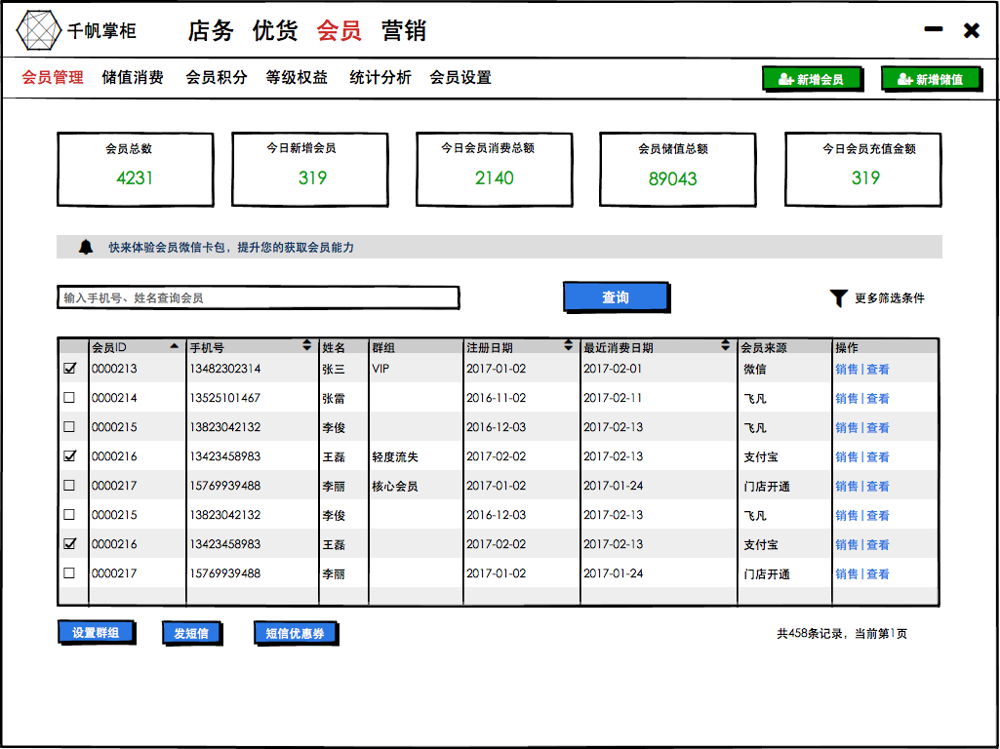
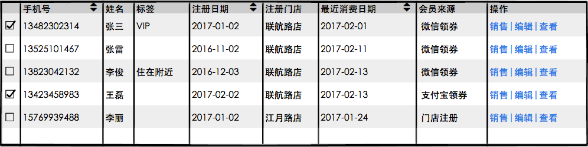
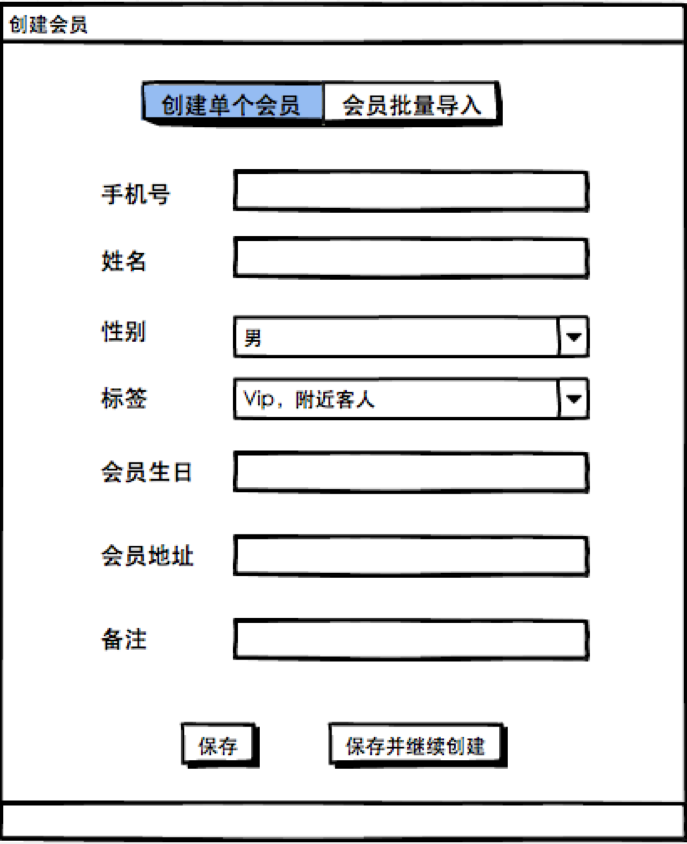
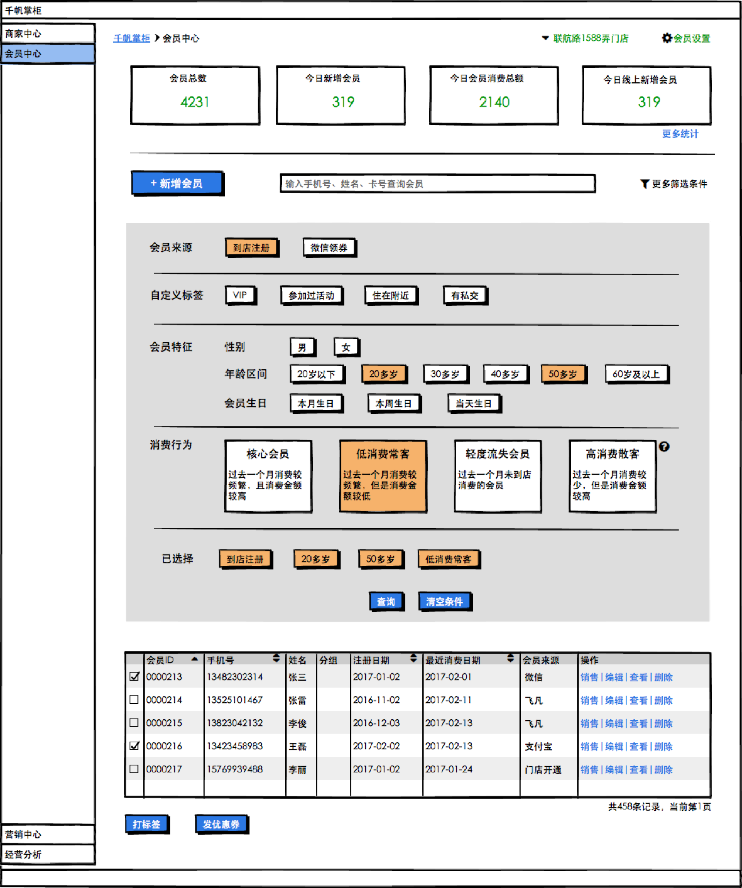

pandoc -s example30.docx -t markdown -o example35.md

# 千帆掌柜会员频道

## 1. 会员资料管理
针对于中小型单体商户，在经营过程中，对于其所属会员进行管理、维护。

功能特性 | 特性描述 
---------|----------
 手动新增会员（会员注册） | 用户可以在DPOS中快速进行新会员资料的录入，按照页面要求填写相关资料。在商户DPOS中创建会员资料
 精确查询会员资料 | 用户可以通过姓名、手机号进行会员精确查询
 通过预设条件进行会员筛选 | 用户户可以通过千帆掌柜中内置的筛选字段，对所有会员进行筛选，例如从会员标签、会员消费频次、会员所属范围等
 查看会员详细资料信息 | 用户可以查看会员的详细资料、消费记录、权益账户详情，并进行编辑
 导入会员资料|商户可以通过会员导入模版，将外部的、已有的会员资料通过上传excel的形式进行导入。

### 1.1 会员中心
会员中心会员中心是千帆掌柜产品中会员相关核心功能的首页，其中包括会员概览看板，会员资料管理、新增会员、会员筛选等。

页面说明：

* 会员总数：商户所有门店下会员数据总数
* 今日新增会员：商户所有门店下今日新增会员总数
* 会员今日消费总额：商户所有会员今日消费总金额，包含线上线下
* 本月可以发送关怀短信的会员：包含未关怀的生日关怀和周年关怀会员
* 更多统计：点击之后跳转到会员统计看板页面，见3.4
* 新增会员：点击弹出新增会员弹框，下文详述
* 点击更多筛选条件：点击展开筛选条件，下方详述
* 点击打标签、发短信、优惠券等下方详述

* 列表中“会员标签“展示该会员关联的自定义标签
* 列表中“会员来源”展示会员的注册渠道，见下述会员注册来源说明
* 列表中“操作列”：点击查看，进入会员详细资料管理
* 列表中“操作列”：点击编辑，进入会员详细资料编辑页面
* 列表中“操作列”：点击销售，进入销售页面，同时该会员信息带到销售界面中

**会员注册渠道说明**

商户的会员注册来源在1.0版本中包含两种注册方式：
* 门店注册 – 消费者在商户的某个门店进行消费之后，给收银员报手机号成为该商户会员
* 微信 – 消费者在微信上领取某个门店发放的优惠券，输入手机号、验证码之后成为会员

任意一种注册方式都有对应的注册门店，表示是哪家门店获取到该会员。

### 1.2 手工新增会员
在会员中心中新增会员
商户在会员中心页面可以点击‘新增会员’打开创建会员弹窗，如下图所示：

新增会员有两种方式：
创建单个会员 – 按照表单，填写会员创建字段并完成创建。点击“填写更多附加内容”之后，窗口会延展并展示更多详细字端，例如会员住址，会员邮箱，会员喜好等。点击‘保存’关闭窗口，点击‘保存并继续创建‘可以继续录入下一条信息

字段 | 是否必填 | 备注
---------|----------|---------
手机号|必填|需要验证手机号规范
姓名|选填 |输入限制10个字
性别|选填|可选内容：空、男、女。
标签|选填|可选自定义标签内容
会员生日|选填|日期筛选输入|
备注|选填|文字描述，长度限制100个字|
会员地址|选填|文字描述，长度限制100个字|

**会员批量导入**

- Step 1: 下载导入Excel模版 
- Step 2: 按照模怕版生成导入会员资料 
- Step 3: 上传导入会员资料 
- Step 4: 系统反馈导入结果（成功导入多少条记录）

批量导入的excel模版按照上面表格中字段要求制定。

**销售界面创建会员**

除了会员中心之外，商户可以在销售界面中进行会员创建并填写会员资料。收银员可以在销售界面的‘会员F6’旁边输入手机号，或者在右侧‘会员信息‘页面新增会员信息。如果手机号已存在，展示会员相应的基础资料信息，以及最近购买、最常购买的商品。如果手机号不存在，则点击付款时，根据输入自动创建会员。

{width="6.6930555555555555in" height="3.879166666666667in"}

销售界面的会员信息只展示手机号、姓名、性别、标签、生日这几个基础字段，会员其余扩展字段不做展示。

###  1.3 会员详细资料管理 

商户点击会员中心页面中的会员列表中任意会员记录，可以查看该会员的详细信息。

{width="6.6930555555555555in"
height="1.6868055555555554in"}

点击会员之后，弹窗展示会员详细资料包含：

#### 会员详细信息

{width="4.35878937007874in"
height="4.451048775153106in"}

弹窗首页位会员详细信息，其中

-   包含会员手机号、姓名、注册时间、注册地点等基础资料信息。

-   包含该会员等购买次数、购买数量、累积消费金额，统计数量均为该会员在商户所有门店的数据合计

-   包含会员的自定义标签。商户可以给用户进行自定义标签设置

-   包含会员拥有的优惠券信息

-   会员扩展信息、备注信息。可以直接在该页面中进行编辑

#### 会员消费记录

{width="4.246920384951881in"
height="2.3512718722659667in"}

-   展示该会员在商户所有累积消费金额
-   列表展示会员在商户指定门店的交易明细。门店下拉列表默认值为当前门店。
-   展示该会员详细消费记录，显示会员相关的销售流水，不进行拆单。
-   支付方式如果有多条，以逗号分隔。例如“现金，支付宝”

#### 会员储值记录

#### 会员优惠券记录
{width="4.092261592300963in"
height="2.7806824146981626in"}

该标签页可以查看会员当前拥有的未使用的优惠券信息，同时也可以查看会员获取、消耗优惠券详情。其中优惠券中间四位以\*号隐去，进行脱敏显示。

#### 历史消息记录 （所有的通知消息记录）

查看商户给会员发送的短信消息，短信类型以及时间。短信类型已营销模块定义为主，包含‘生日关怀短信’，‘促销短信‘等。

{width="5.933442694663167in"
height="3.9689676290463693in"}

#### 快速销售

商户点击弹窗右上角的‘快速销售’按钮，跳转到针对该会员的销售页面

###  1.4 搜索会员

{width="6.6930555555555555in"
height="2.363888888888889in"}

-   商户在搜索框内，支持手机号、姓名进行会员搜索。返回符合条件的所有会员结果

-   点击更多筛选条件，展开下方4.1.5“筛选会员”

###  1.5 筛选会员

商户点击搜索框旁边的‘更多筛选条件’之后，页面展开显示不同维度的筛选条件，包括：

-   会员来源：
    -   门店注册
    -   微信会员
-   会员自定义标签 – 展示商户自主创建的自定义会员标签
-   会员特征：性别（男、女）、年龄（20岁以下、20多岁、30多岁、40多岁、50多岁、60级以上）、会员生日（本周生日、本月生日、当日生日）
-   消费行为：核心会员、低消费常客、轻度流失会员、高消费散客

**详细内容见3.3 **

## 2. 会员标签

## 3. 会员群组？

## 3. 会员储值

## 4. 会员统计报表

## 5. 系统实现说明