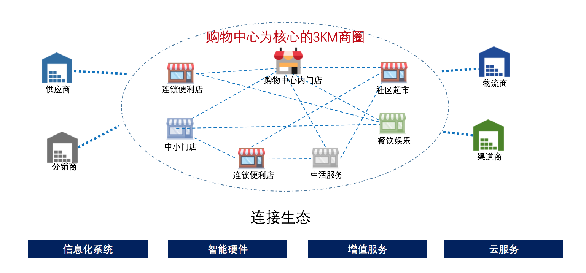

# 购物中心解决方案

## 核心场景
1. 购物中心会员管理与运营

2. 购物中心线上线下智能营销

3. 借用新媒体渠道，快速拓展购物中心粉丝

4. 更紧密的连接购物中心与购物中心内的商家

连接购物中心内，甚至是购物中心周边的店铺。 

## 购物中心信息化管理解决方案

### 1. 招商管理 - 全球招商平台
### 2. 独立自主的会员管理系统
### 3. 

## 购物中心线上营销解决方案

## 连接店铺