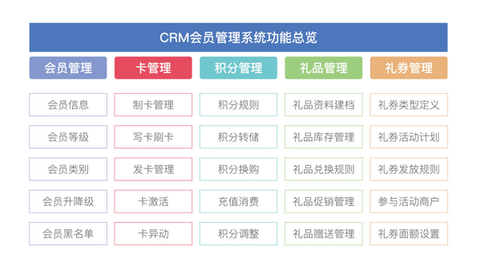

# 购物中心解决方案

## 实现购物中心的信息一体化、集团化

为购物中心提供完整的
商业地产的信息系统应该实现一体化、集团化；
在运营模式上，可支持单店模式、连锁模式或区域连锁模式；
在业态组合上，匹配零售、餐饮、专卖、娱乐等全业态信息化系统需求；
另外，科脉商业地产信息化解决方案，还可保证系统架构的合理部署、架构应用、集成安全等；全系统、大格局。

## 核心场景

### 1. 独立自主的购物中心会员管理系统，帮助购物中心搭建、运营自己的会员体系

### 2. 通过营销活动，更紧密的连接购物中心与购物中心内的商家

### 3. 借用新媒体渠道，快速拓展购物中心粉丝

## 配套产品

