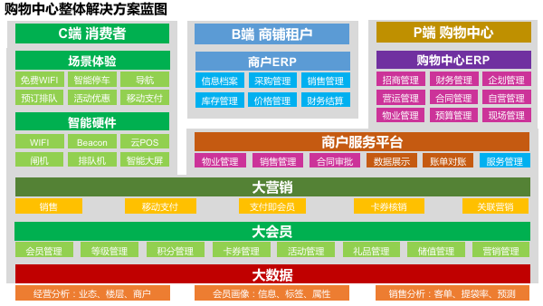

# 购物中心解决方案

## 实现购物中心的信息一体化、集团化

为购物中心提供完整的
商业地产的信息系统应该实现一体化、集团化；
在运营模式上，可支持单店模式、连锁模式或区域连锁模式；
在业态组合上，匹配零售、餐饮、专卖、娱乐等全业态信息化系统需求；
另外，千帆商业地产信息化解决方案，还可保证系统架构的合理部署、架构应用、集成安全等；全系统、大格局。

## 核心场景

### 1. 独立自主的购物中心会员管理系统，帮助购物中心搭建、运营自己的会员体系
对购物中心来说，找到核心目标客户群，提升关键客户的消费满意度，提高其消费频率、金额，对整体营业额的提升非常关键。
千帆CRM管理系统，帮助企业充分掌握客户资料，获取市场反馈，从而提高服务水平，制定市场策略，主动出击，提升购物中心竞争力。

### 2. 通过营销活动，更紧密的连接购物中心与购物中心内的商家。
购物中心可以发起营销活动，吸引场所内的门店进行参与。通过多渠道的营销活动将商户与购物中心的客流串联起来

### 3. 借用新媒体渠道，快速拓展购物中心粉丝

### 4. 购物中心招商场景

通过全球招商平台，帮助购物中心引进优质的商家资源。协助商家进行清晰的招商规划分析，包括引入品牌档次、引进商户业态分布、引入品牌的楼层分布、商铺规划等，帮助商家确定招商计划及目标对象。

### 5. 购物中心强大的数据采集场景
通过千帆数据通产品搭建的购物中心管理平台，与商家使用POS机打通数据接口，利用软采集、数据通等工具，将所有商户数据集中到购物中心集团总部，实现购物中心数据集中化、一体化。

## 配套产品

